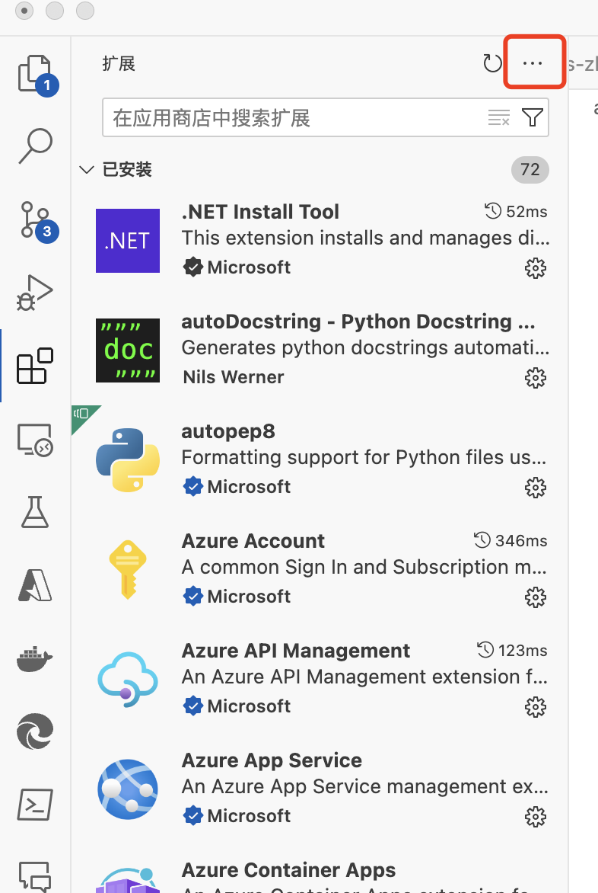
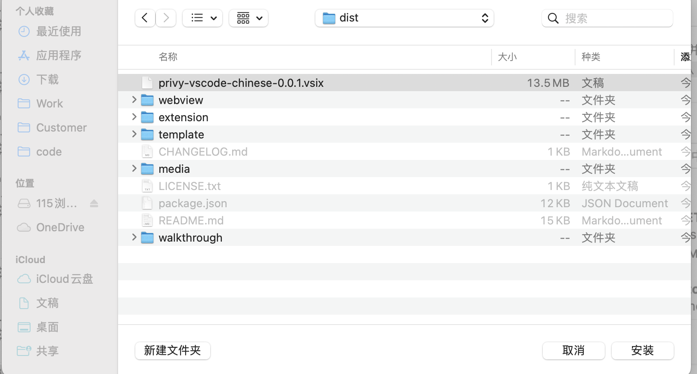
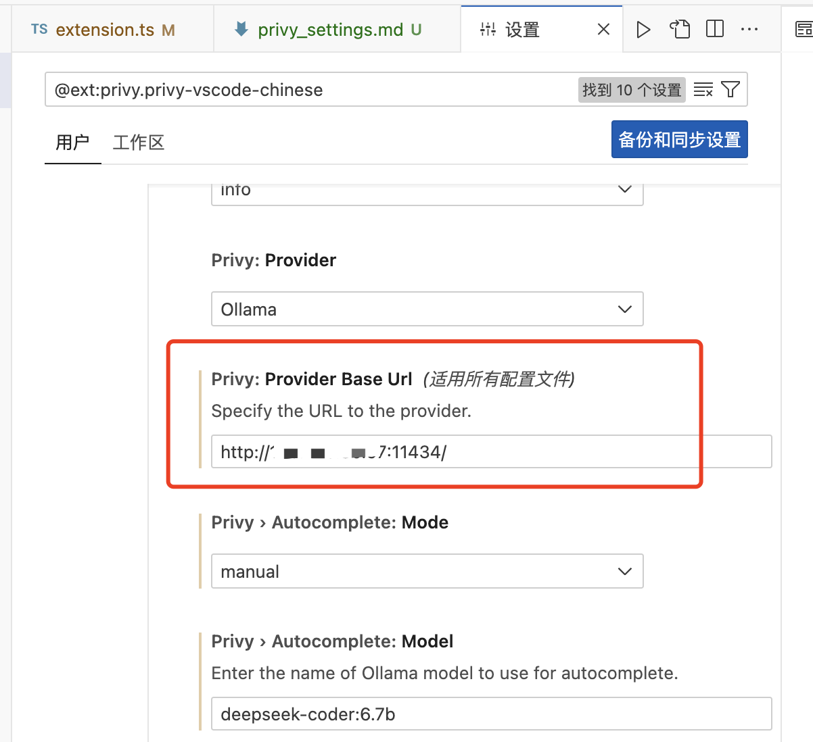

# Privy Chinese 部署与配置指南

## 1. 部署私有模型

执行 `privy-chinese-azure-infra.sh` 脚本，部署私有模型到 Azure 云上。默认部署的模型是 `deepseek-coder:6.7b` 和 `deepseek-coder:6.7b-instruct`， 你可以根据自己的需求部署其他模型。具体的区域、资源组、VNet、VM SKU 等参数可以在 infra.sh 脚本中修改。

```bash
./privy-chinese-azure-infra.sh
```

部署脚本中的大致逻辑如下：

- 创建资源组、VNet、子网、公共 IP、网络安全组
- 创建具有 GPU 的虚拟机并与公共 IP 关联
- 开放 11434 端口，用于模型服务
- 安装 ollama，修改 ollama 的 host 配置为 0.0.0.0，可以根据自己的需求修改 ollama 的配置
- 通过 ollama 下载 `deepseek-coder:6.7b` 和 `deepseek-coder:6.7b-instruct` 模型
- 启动模型服务

## 2. 安装 Privy

下载 Visual Studio Code 并安装。
打开 VS Code，点击左侧侧边栏的 Extensions 按钮，选择 `从 VSIX 安装...`。


选择`privy-0.0.1.vsix`文件，点击安装。



## 3. 配置 Privy

点击左侧侧边栏的 Privy 图标，点击右上角中间的 Settings 按钮。


修改 `Privy: Provider Base URL`参数，填入你的后端私有模型 IP 和端口。


> 如果有必要，可以修改 ` Privy > Autocomplete:Model``Privy: Custom Model ` 为你自己的模型名称。
